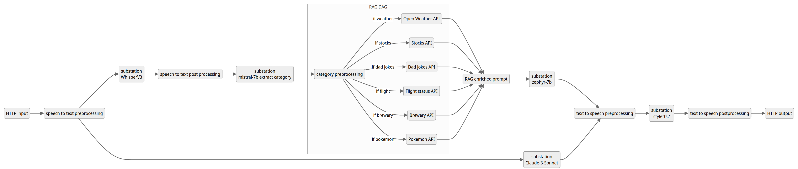
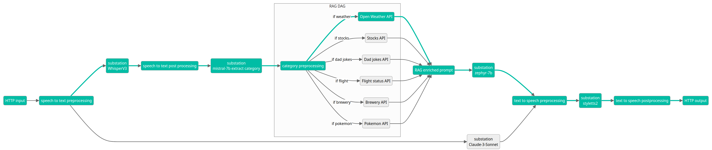
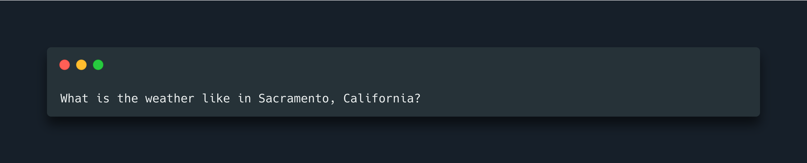
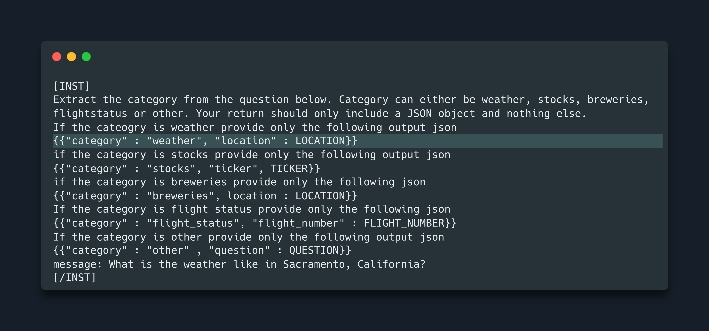
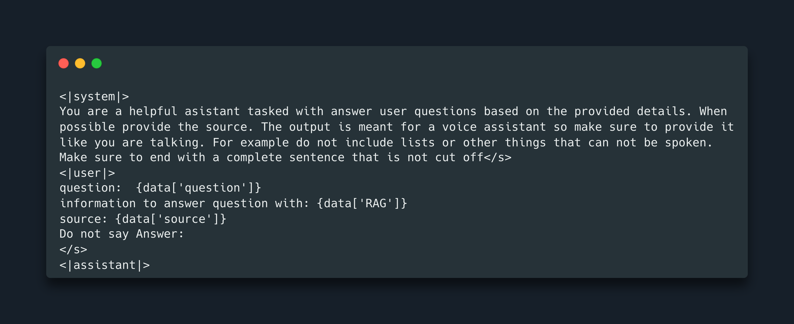
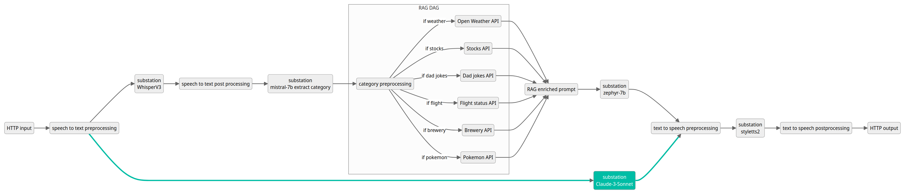
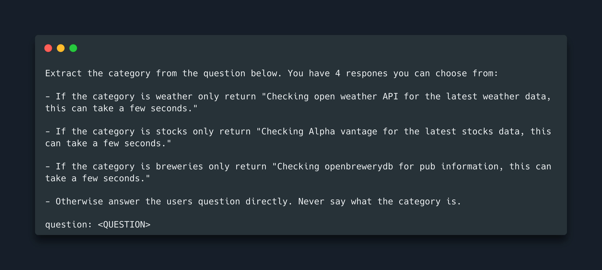
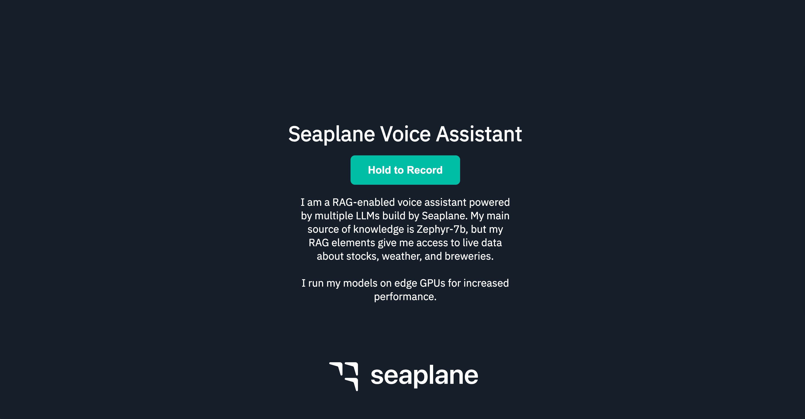
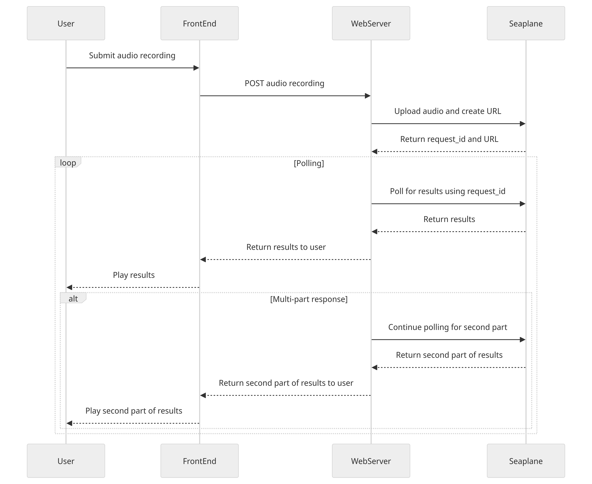

# Seaplane Voice Assistant Demo

This repository holds the code for the Seaplane voice assistant demo. If you are building a voice assistant use this repository as a basis for your project. Furthermore, if you have developed an interesting/useful/cool RAG element we encourage you to submit a PR to further increase the capabilities of the voice assistant.

## Application Architecture and Design

The diagram above provides a high-level overview of our application's architecture. Although it may appear complex with numerous boxes and arrows, the overall structure is straightforward. Let’s focus on a single pass through the DAG (directed acyclic graph) to address the following user input question:

“What is the weather like in Sacramento, California?”

We can visualize the message path through our DAG as follows:

The user records the audio using a simple web interface and then calls the Seaplane API endpoint with the recording. Subsequently, the recorded audio is processed through OpenAI's `whisper-large-v3`, resulting in the following text output:

During the speech-to-text post-processing task, we generate a new prompt to extract the category from the message and any required metadata the RAG DAG needs to execute its functions. The prompt typically takes the following form. In the case of a weather-related question, the LLM extracts the highlighted JSON.

We utilized mistral-7b-instruct with the lowest temperature setting of 0.01 to extract the information. Mistral-7b-instruct, operated on edge GPUs by Seaplane, is the best LLM for this task. Instruct models excel at extracting JSON-formatted data compared, and Mistral's small size and speed align perfectly with our requirements, minimizing latency.

Based on the extracted category, we route the request to the appropriate task in the RAG DAG. We do so by using Seaplane's built-in functionality for conditional routing. In this instance, as it's a weather-related query, we leverage the Open Weather API to gather the latest weather data for the specified location. Subsequently, we construct a prompt to address the input question.

We've incorporated some guiding language to ensure the output is suitable for a text-to-speech model, and we've engineered the prompt to avoid awkward responses like `Answer:`. For this task, we leverage Zephyr-7b, another compact model run on the edge GPUs hosted by our partner [Vultr](https://www.vultr.com/) and operated by Seaplane. The primary advantage of this small LLM here is reduced latency, a crucial factor in our setup.

The output from Zephyr is processed through [yl4579/StyleTTS2](https://github.com/yl4579/StyleTTS2) provided by Seaplane to generate the expected audio response from a voice assistant. We opted for StyleTTS2 due to its speed and performance. Unlike other models we tested, it's notably faster and yields high-quality results. However, we did encounter an issue: it crashes when generating audio snippets longer than 10 seconds without sample audio, a known limitation within the community.

This breakdown covers a single run through the application. However, observant readers may notice a secondary path through the DAG. This path serves two purposes:

1. Directly answering questions that don't require RAG.
2. Concealing latency.

Let's address the first point. Not all user requests necessitate RAG processing. Routing these requests through the entire RAG DAG introduces unnecessary latency. To mitigate this, we directly address such questions. How? By routing all input requests through both paths simultaneously. While the RAG DAG processes the request, we also run it through what we call the "quick answer path." This path comprises a single task utilizing `claude-3-sonnet` with a prompt that either answers the question directly or tells the user we are retrieving live data. 

If the LLM determines that the category doesn't match any of the RAG categories, it will directly respond to the question and send the output to StyleTTS2. It will utilize the low-latency KV store to mark the question as answered, thereby blocking further output from the RAG DAG. While this approach might not be the most cost-effective, it's highly efficient in terms of latency.

Now, onto the second benefit. As the prompt above clarifies, the quick answer path always yields output. However, if the LLM identifies the question as requiring RAG processing, it returns a specific sentence. For instance, in the case of weather-related queries, it might say, “Checking the Open Weather API for the latest weather data.” This output is passed to StyleTTS2 and relayed as audio to the user without marking the question as answered. As a result, the RAG DAG path can proceed to provide the actual answer.

This strategy doesn't reduce the latency of the RAG DAG path, but it effectively conceals it from the user. While the voice assistant engages with the user and retrieves data from a source, the RAG DAG completes its task and follows up with the actual answer. 

Such latency hiding has become standard practice in LLM-based applications. For instance, ever wondered why LLMs stream results back to the chat client? Exactly, to obscure the fact that generating the complete result takes time.

## Web Interface

Recognizing that most users prefer a more user-friendly interaction with a voice assistant than directly interfacing with an API endpoint, we've created a simple JavaScript-based frontend application. This frontend application facilitates audio recording and queries the Seaplane API endpoint for a response.

To bridge the gap between the frontend application and the Seaplane API, we've implemented a middle layer using a Python-based HTTP server. This application component handles the uploading of audio recordings to a public bucket, submits the URL to Seaplane, and continuously polls the GET endpoint for a response.

In scenarios where the response from Seaplane consists of two parts, as indicated by the JSON object output, the web server initiates a second polling request to retrieve the second audio output, i.e., the RAG-enriched output. This process ensures a smooth and user-friendly experience when interacting with our voice assistant application.

## Start building today
[Sign up for the Seaplane beta](https://www.seaplane.io/join-the-seaplane-beta) to get access to the platform and start building your genai application today!